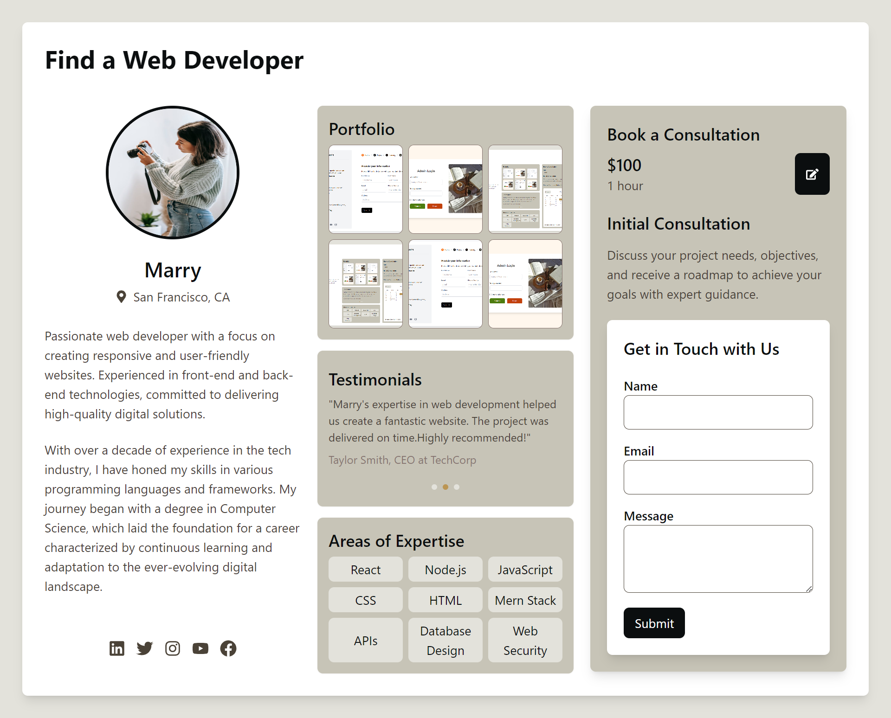

# Web Developer Portfolio App

This is a React application showcasing a web developer's portfolio. The app includes features like image galleries, testimonials, social media links, and a contact form.

## Features

- **Developer Information**: Displays the developer's profile, including a brief introduction and experience.
- **Portfolio Gallery**: Clickable images that open a modal for an enlarged view.
- **Testimonials**: Auto-scrolling testimonials that highlight feedback from past clients.
- **Social Media Links**: Connect with the developer on various social media platforms.
- **Consultation Booking**: Provides details and a booking button for consultation services.
- **Contact Form**: A form to get in touch with the developer, with toast notifications for submissions.

## Technologies Used

- **React**: For building the user interface.
- **React Icons**: For displaying icons.
- **React Toastify**: For toast notifications.
- **Tailwind CSS**: For styling the application.

## Folder Structure

portfolio-app/
  ├── public/
  │   ├── index.html
  │   └── Images/
  │       ├── Profile_img.jpg
  │       ├── Screenshot.png
  │       ├── Screenshot2.png
  │       └── Screenshot5.png
  ├── src/
  │   ├── App.js
  │   ├── index.js
  │   └── styles.css
  ├── package.json
  └── README.md

## Screenshot

